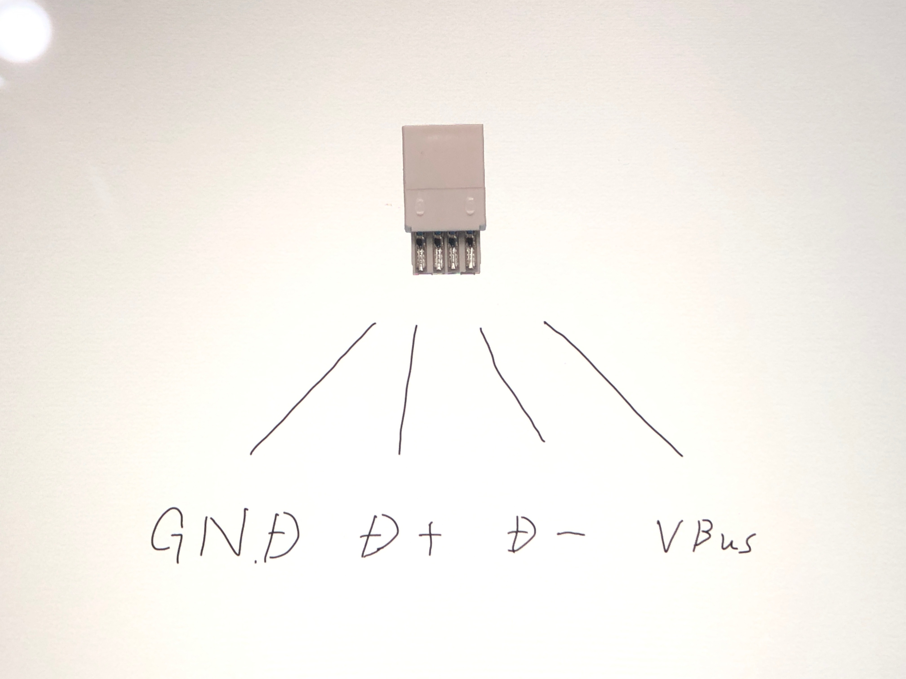

# 自作USBケーブルの作り方

## キット内容
 - micro-B USBコネクタ
 - type-A USBコネクタ
 - 4芯ケーブル
 - パラコード
 - ケーブルスリーブ
 - 熱収縮チューブ * 2

## 必要な工具
 - カッターナイフ
 - マスキングテープ
 - はんだごて
 - はんだ
 - はんだ吸い取り線
 - ニッパー
 - ラジオペンチ
 - ホットエアーなどの熱源
 - テスターなど、導通を確認できるもの

## あると便利な道具
 - はんだ吸い取り器

## 作り方 ダイジェスト版
 1. パラコードから出ている白い紐を取り除きます
 1. 4芯ケーブルをパラコードの中に通します
 1. パラコードと4芯ケーブルの先がバラバラにならないようにマスキングテープを巻くように貼り付けます
 1. ケーブルスリーブの両端を留めているマスキングテープを ***片側だけ*** 取り外します
 1. 手順3で作ったものをケーブルスリーブの中に通します
 1. ケーブルスリーブの端まで通したところでケーブルスリーブを留めているマスキングテープを取り外します
 1. ケーブルスリーブが長くバラバラにならないようにマスキングテープを巻くように貼り付けます
 1. 手順3で貼り付けたマスキングテープを取り外し、パラコード/ケーブルスリーブを適当な長さに揃えます
 1. 4本の芯線の色を確認し、micro-BコネクタのD-とD+に該当する芯線の被覆を取り除きます \*各色がそれぞれ対応しないので、ページ末尾の表のとおりに対応させます
 1. micro-Bコネクタの対応する端子に芯線を奥までしっかりと差し込みます \*外側2線に関しても、被覆ありで差し込みづらい場合は被覆を取り除いて差し込みます
 1. 黒い部分と緑色の部分が平らになるようにしっかりと押し付けます
 1. 反対側の、4芯ケーブルの終わり付近でパラコード/ケーブルスリーブの長さを調整します *バラバラにならないようにマスキングテープで留めて、先端から2cm程度のところを切断します
 1. コネクタの裏表を確認し、4芯ケーブルの被覆を取り除きます
 1. ページ末尾の表と画像をよく確認しながら、Type-Aコネクタの対応する端子に芯線をはんだ付けします
 1. Type-Aコネクタ側で、テスターなどを用いて隣り合う端子どうしに短絡がないことを確認します
 1. 金属のハウジングを取り付けます \*Type-A側の金属ハウジングは縦に線の入ったほうが裏側になるようにしっかり確認して、はんだ付けしたコネクタが奥に当たるまでしっかり差し込みます \*micro-B側の金属ハウジングは緑の部分が下側になるように置き、ラジオペンチなどを使って折りたたむように加工します
 1. ツメが穴に収まっていることを確認して、グレーの被覆線露出部に巻きつけるように加工します
 1. ホットエアーなどを使って熱収縮チューブを収縮させます
 1. USBハブなどを介して動作確認をします \*直接の接続は結線不良時にPCを破壊する可能性があるのでUSBハブなどを使用します
 
 ## 問題がなければ以上で完成です。

 |micro-B connector|line|cable(芯線の色)|
 |---|---|---|
 |R|VBus|Yellow(黄)|
 |W|D-|White(白)|
 |G|D+|Green(緑)|
 |B|GND|Brown(茶)|

### Type-A connector Pin Assign

