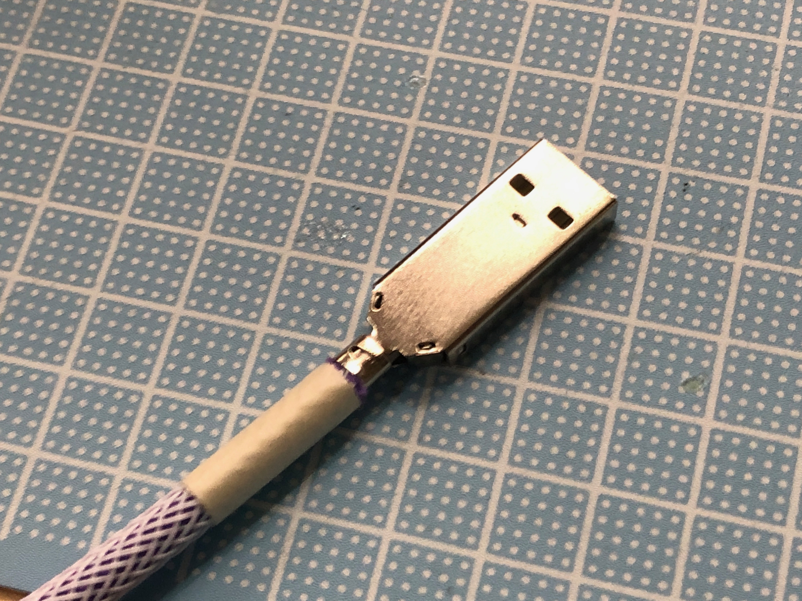

怪我の無いよう、手元に注意しながら作業を進めましょう。

## キット内容
 - micro-B USBコネクタ
 - type-A USBコネクタ
 - 4芯ケーブル
 - パラコード
 - ケーブルスリーブ
 - 熱収縮チューブ * 2

## 必要な工具
 - カッターナイフ
 - マスキングテープ
 - はんだごて
 - はんだ
 - はんだ吸い取り線
 - ニッパー
 - ラジオペンチ
 - ホットエアーなどの熱源
 - テスターなど、導通を確認できるもの

## あると便利な道具
 - はんだ吸い取り器

## 1: パラコードから出ている白いひもを取り除きます

## 2: 4芯ケーブルをパラコードの中に通します

## 3: 先端がバラけないようにマスキングテープを貼り付けます

## 4: スリーブ両端を留めているマスキングテープを ***片側だけ*** 取り外します

## 5: スリーブの端まで進めたところでもう片方のマスキングテープを取り外します

## 6: 長くほどけないようにスリーブの上からマスキングテープで留めます

## 7: 手順3のマスキングテープを取り外し、ニッパーやカッターナイフなどでスリーブを適当な長さに調整して4芯ケーブルの被覆を5mm程度剥がします

## 8: 4本の芯線の被覆の色とmicro-Bコネクタの刻印を確認します

各色がそれぞれで対応しないので、

|connector|line|cable|
|---|---|---|
|R|VBus|Yellow(黄)|
|W|D-|White(白)|
|G|D+|Green(緑)|
|B|GND|Brown(茶)|

として、D-とD+に該当する中2線の被覆を剥がします

## 9: micro-Bコネクタの緑色の部分に差し込みます

上の表通りに芯線を並べてコネクタ部に奥までしっかりと差し込みます *差し込みづらい場合は外2線の被覆に関しても被覆を取り除いてしまって構いません

## 10: 緑色の部分を黒い部分とが平らになるように押し付けます

## 11: 4芯ケーブルの終わり付近でパラコード/スリーブの長さを調整します

ばらばらにならないようにマスキングテープで留めてから、切断します

## 12: パラコード/スリーブを2cm程度取り除きます

## 13: Type-Aコネクタの裏表を確認し、4芯ケーブルの被覆を剥がします

## 14: コネクタの裏側に芯線をはんだ付けします

手順9で手順8の表通りに芯線を差し込んだ場合、各線との関係は以下の通りです

|line|cable|
|---|---|
|VBus|Yellow(黄)|
|D-|White(白)|
|D+|Green(緑)|
|GND|Brown(茶)|

上の表をよく確認しながら、Type-Aコネクタの対応する端子に芯線をはんだ付けします

## 15: Type-A側の端子で、テスターなどを用いて隣り合う端子同士の短絡がないことを確認します

### 短絡が見られた場合、micro-B側の芯線で接触している可能性があるります。はめ込んだ緑の部分を取り外してよく確認します

## 16: 金属ハウジングを取り付けます

### micro-B側

緑色の部分が下向きになるようにハウジングに乗せ、ラジオペンチなどを使って折りたたみます

芯線が露出している部分も同様に、巻きつけるように加工します

### Type-A側

線の入ったほうが裏側になるようにしっかり確認して、はんだ付けしたコネクタを奥に当たるまで差し込みます

ツメが穴に収まっていることを確認して、グレーの被覆露出部を巻きつけるように加工します

## 17: ホットエアーなどを使って、熱収縮チューブを収縮させます

### micro-B側

### Type-A側

## 18: 動作確認をして、完成です

直接の接続は結線不良時にPCを破壊する可能性があるので、USBハブなどを用いて動作確認をします

問題がなければ、完成です

